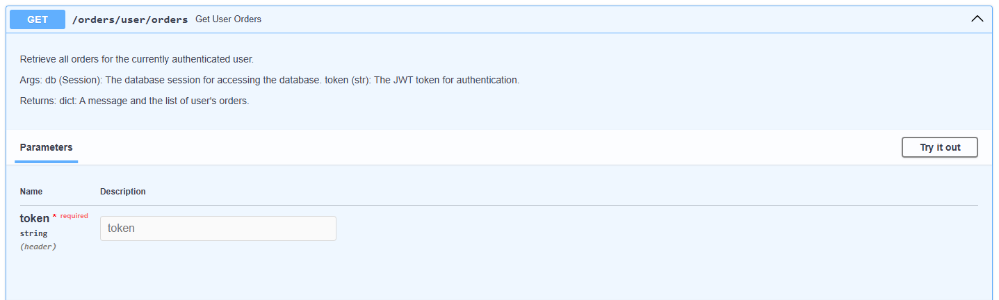
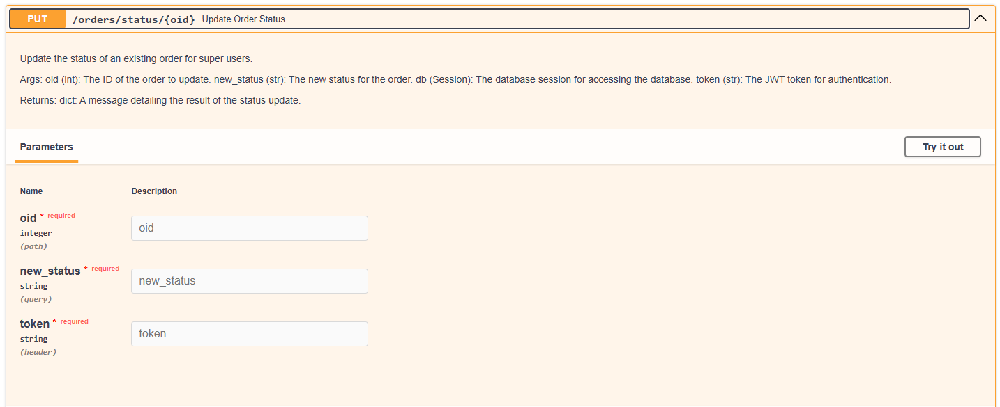

# Pizza Order API

## Overview

The Pizza Order API is a RESTful API built with FastAPI, designed to enable users to manage their pizza orders efficiently. It provides features for user authentication, order management, and administrative capabilities for staff to oversee all orders. This system aims to enhance the pizza ordering experience with a strong focus on performance and security.

## Table of Contents

- [Features](#features)
- [Technologies Used](#technologies-used)
- [Installation](#installation)
- [Usage](#usage)
- [Logging](#logging)
- [Environment Variables](#environment-variables)
- [API Endpoints](#api-endpoints)
  - [Authentication](#authentication)
  - [Order Management](#order-management)

## Features

- **User Management:**
  - User signup and account creation.
  - User login with JWT token-based authentication.
  - Token refresh functionality.
  - Public and protected endpoints for user access control.

- **Order Management:**
  - Place new pizza orders.
  - Retrieve all orders (staff access only).
  - Fetch specific orders by ID (staff access only).
  - Retrieve all orders for the currently authenticated user.
  - Retrieve a specific order for the currently authenticated user.
  - Update existing orders for the authenticated user.
  - Change order status (staff access only).
  - Delete existing orders for the authenticated user.

## Technologies Used

- **FastAPI:** A high-performance web framework for building APIs in Python.
- **SQLAlchemy:** An Object-Relational Mapping (ORM) tool for database interaction.
- **Pydantic:** Data validation and settings management using Python type annotations.
- **JWT:** A secure token-based authentication mechanism.
- **SQLite:** A relational database system for storing user and order data.
- **Uvicorn:** A lightning-fast ASGI server to run the FastAPI application.

## Installation

1. **Clone the repository:**

   ```bash
   git clone https://github.com/jeetendra29gupta/pizza-order-api.git
   ```

2. **Navigate to the project directory:**

   ```bash
   cd pizza-order-api
   ```

3. **Set up a virtual environment:**

   ```bash
   python -m venv venv
   ```

4. **Activate the virtual environment:**

   - On Windows:
     ```bash
     venv\Scripts\activate
     ```
   - On macOS/Linux:
     ```bash
     source venv/bin/activate
     ```

5. **Install the required packages:**

   ```bash
   pip install -r requirements.txt
   ```

6. **Set up the database:**

   Configure your database connection in the `database.py` file.

## Usage

1. **Start the API server:**

   ```bash
   python main_app.py
   ```

2. **Access the API documentation:**

   Open your browser and navigate to:

   ```plaintext
   http://localhost:8181/docs
   ```

   This provides interactive API documentation powered by Swagger UI.

## Logging

The application includes logging for tracking requests and errors. Logs are stored in a designated log file for auditing and debugging purposes.

## Environment Variables

Ensure to set the following environment variables in your `.env` file:

- **SECRET_KEY:** Key used for JWT encoding/decoding.
- **ALGORITHM:** Algorithm used for JWT signing.
- **ACCESS_TOKEN_EXPIRE_MINUTES:** Expiration time for access tokens.
- **REFRESH_TOKEN_EXPIRE_DAYS:** Expiration time for refresh tokens.

## API Endpoints


### Authentication

#### 1. **POST** `/auth/signup/`


- **Description:** Create a new user account.
- **Request Body:**
  ```json
  {
    "username": "string",
    "password": "string",
    "email": "user@example.com"
  }
  ```
- **Response:**
  - **Status Code:** `201 Created`
  - **Body:**
  ```json
  {
    "detail": "User created successfully!",
    "user": {
      "username": "string",
      "email": "user@example.com"
    },
    "date_time": "2024-10-25T12:34:56"
  }
  ```

#### 2. **POST** `/auth/login/`


- **Description:** Authenticate a user and return JWT tokens.
- **Request Body:**
  ```json
  {
    "username": "string",
    "password": "string"
  }
  ```
- **Response:**
  - **Status Code:** `200 OK`
  - **Body:**
  ```json
  {
    "detail": "Login successful",
    "token": {
      "access": "jwt_access_token",
      "refresh": "jwt_refresh_token"
    },
    "date_time": "2024-10-25T12:34:56"
  }
  ```

#### 3. **GET** `/auth/`


- **Description:** Sample public hello world route.
- **Response:**
  - **Status Code:** `200 OK`
  - **Body:**
  ```json
  {
    "message": "Hello World",
    "date_time": "2024-10-28 12:55:59"
  }
  ```

#### 4. **GET** `/auth/message`


- **Description:** Protected route that returns a greeting message.
- **Request Header:**
  ```plaintext
  jwt_access_token
  ```
- **Response:**
  - **Status Code:** `200 OK`
  - **Body:**
  ```json
  {
    "message": "Hello World",
    "date_time": "2024-10-28 12:55:59",
    "user": "username"
  }
  ```

#### 5. **GET** `/auth/refresh`


- **Description:** Refresh the user's token.
- **Request Header:**
  ```plaintext
  jwt_refresh_token
  ```
- **Response:**
  - **Status Code:** `200 OK`
  - **Body:**
  ```json
  {
    "detail": "Token is refreshed",
    "token": {
      "access": "jwt_access_token",
      "refresh": "jwt_refresh_token"
    },
    "date_time": "2024-10-25T12:34:56"
  }
  ```

### Order Management

#### 6. **POST** `/orders/`


- **Description:** Place a new order for pizza.
- **Request Body:**
  ```json
  {
    "quantity": 2,
    "pizza_size": "medium",
    "flavour": true
  }
  ```
- **Response:**
  - **Status Code:** `201 Created`
  - **Body:**
  ```json
  {
    "detail": "Order placed successfully!",
    "order": {
      "id": 1,
      "user_id": "string",
      "quantity": 2,
      "pizza_size": "medium",
      "flavour": true,
      "order_status": "pending"
    },
    "date_time": "2024-10-25T12:34:56"
  }
  ```

#### 7. **GET** `/orders/`


- **Description:** List all orders (accessible to staff only).
- **Request Header:**
  ```plaintext
  jwt_access_token
  ```
- **Response:**
  - **Status Code:** `200 OK`
  - **Body:**
  ```json
  {
    "message": "List of all orders",
    "orders": [
      {
        "id": 1,
        "user_id": "string",
        "quantity": 2,
        "pizza_size": "medium",
        "flavour": true,
        "order_status": "pending"
      }
    ],
    "date_time": "2024-10-25T12:34:56"
  }
  ```

#### 8. **GET** `/orders/{oid}`


- **Description:** Retrieve a specific order by ID (staff access only).
- **Parameters:**
  - `oid`: Order ID (integer).
- **Request Header:**
  ```plaintext
  jwt_access_token
  ```
- **Response:**
  - **Status Code:** `200 OK`
  - **Body:**
  ```json
  {
    "message": "Order retrieved successfully.",
    "order": {
      "id": 1,
      "user_id": "string",
      "quantity": 2,
      "pizza_size": "medium",
      "flavour": true,
      "order_status": "pending"
    },
    "date_time": "2024-10-25T12:34:56"
  }
  ```

#### 9. **GET** `/orders/user/orders`



- **Description:** Retrieve all orders for the authenticated user.
- **Request Header:**
  ```plaintext
  jwt_access_token
  ```
- **Response:**
  - **Status Code:** `200 OK`
  - **Body:**
  ```json
  {
    "message": "User orders retrieved successfully.",
    "orders": [
      {
        "id": 1,
        "user_id": "string",
        "quantity": 2,
        "pizza_size": "medium",
        "flavour": true,
        "order_status": "pending"
      }
    ],
    "date_time": "2024-10-25T12:34:56"
  }
  ```

#### 10. **GET** `/orders/user/order/{oid}`


- **Description:** Retrieve a specific order for the authenticated user.
- **Parameters:**
  - `oid`: Order ID (integer).
- **Request Header:**
  ```plaintext
  jwt_access_token
  ```
- **Response:**
  - **Status Code:** `200 OK`
  - **Body:**
  ```json
  {
    "message": "Order retrieved successfully.",
    "order": {
      "id": 1,
      "user_id": "string",
      "quantity": 2,
      "pizza_size": "medium",
      "flavour": true,
      "order_status": "pending"
    },
    "date_time": "2024-10-25T12:34:56"
  }
  ```

#### 11. **PUT** `/orders/update/{oid}`


- **Description:** Update an existing order for the authenticated user.
- **Parameters:**
  - `oid`: Order ID (integer).
- **Request Body:**
  ```json
  {
    "quantity": 3,
    "pizza_size": "large",
    "flavour": false
  }
  ```
- **Request Header:**
  ```plaintext
  jwt_access_token
  ```
- **Response:**
  - **Status Code:** `200 OK`
  - **Body:**
  ```json
  {
    "detail": "Order updated successfully!",
    "order": {
      "id": 1,
      "user_id": "string",
      "quantity": 3,
      "pizza_size": "large",
      "flavour": false,
      "order_status": "pending"
    },
    "date_time": "2024-10-25T12:34:56"
  }
  ```

#### 12. **PUT** `/orders/status/{oid}`



- **Description:** Update the status of an existing order (staff access only).
- **Parameters:**
  - `oid`: Order ID (integer).
- **Request Body:**
  ```json
  {
    "new_status": "completed"
  }
  ```
- **Request Header:**
  ```plaintext
  jwt_access_token
  ```
- **Response:**
  - **Status Code:** `200 OK`
  - **Body:**
  ```json
  {
    "detail": "Order status updated successfully!",
    "order": {
      "id": 1,
      "user_id": "string",
      "quantity": 3,
      "pizza_size": "large",
      "flavour": false,
      "order_status": "completed"
    },
    "date_time": "2024-10-25T12:34:56"
  }
  ```

#### 13. **DELETE** `/orders/delete/{oid}`


- **Description:** Delete an existing order (staff access only).
- **Parameters:**
  - `oid`: Order ID (integer).
- **Request Header:**
  ```plaintext
  jwt_access_token
  ```
- **Response:**
  - **Status Code:** `200 OK`
  - **Body:**
  ```json
  {
    "detail": "Order deleted successfully!"
  }
  ```